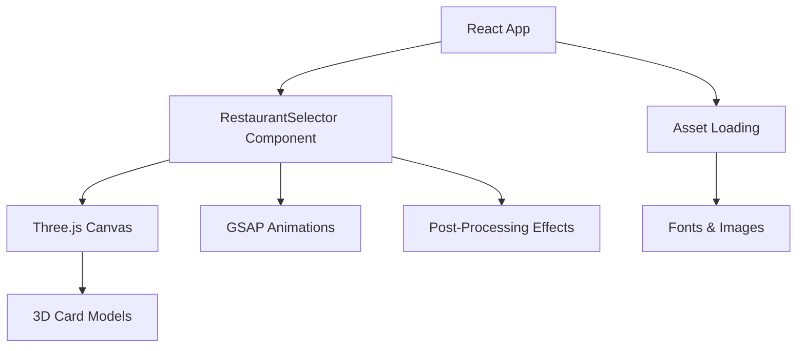

s# Project Overview

Miximixi is a 3D restaurant selector application built with React, Vite, and Three.js. The app provides an interactive card-based interface for randomly selecting restaurants with animated 3D effects and post-processing. It uses GSAP for animations and react-window for performance optimization.

## Repository Structure

```
miximixi/
├── .windsurf/          # Windsurf AI skills and workflow automation
├── miximixi/           # Main React application source code
│   ├── public/         # Static assets (fonts, images)
│   ├── src/            # React components and application logic
│   └── dist/           # Build output directory
├── openspec/           # OpenSpec-driven development documentation
│   ├── changes/        # Feature change specifications
│   └── specs/          # Detailed technical specifications
└── AGENTS.md          # This file - AI agent guidelines
```

## Build & Development Commands

### Frontend (React + Vite)

```bash
# Install dependencies
cd miximixi && npm install

# Start development server (runs on port 3000)
npm run dev

# Build for production
npm run build

# Preview production build
npm run preview
```

### Backend (Go + SQLite)

```bash
# Start backend service
cd restaurant-api && go run .

# Run tests
go test -v ./...
```

> **Go Workspaces**: For multi-module repos, create `go.work` in project root to avoid "cannot find main module" errors.

## Code Style & Conventions

- **Framework**: React 19 with functional components and hooks
- **Styling**: CSS modules and global styles in `src/index.css`
- **3D Graphics**: Three.js with @react-three/fiber for React integration
- **Animations**: GSAP for smooth transitions and effects
- **Responsive Design**: react-responsive for media query detection
- **Commit Messages**: Use descriptive messages summarizing changes
- **Branch Naming**: Use kebab-case feature branches (e.g., `add-windsurf-skills`)

> TODO: Define specific lint rules, formatting standards, and commit message templates. Configure ESLint, Prettier, or similar tools.

## Architecture Notes



**Major Components:**
- **App.jsx**: Main application entry point with responsive header
- **RestaurantSelector**: Core component managing card selection logic with responsive layout
- **useResponsive Hook**: Custom hook providing responsive sizes and screen type detection
- **Three.js Integration**: @react-three/fiber renders 3D restaurant cards
- **Post-Processing**: @react-three/postprocessing adds visual effects
- **Animation System**: GSAP handles card flip and selection animations
- **Infinite Scroll**: Triple-duplication with scrollLeft-based seamless looping

**Data Flow:**
1. User interacts with card interface (wheel scroll for horizontal navigation)
2. useResponsive Hook provides responsive sizes based on screen type (mobile/tablet/desktop)
3. RestaurantSelector manages state and triggers GSAP animations
4. Three.js renders 3D scene with post-processing effects
5. GSAP animates card scaling based on viewport center position

## Testing Strategy

> TODO: No testing framework configured. Consider adding:
- **Unit Tests**: Jest or Vitest for component logic
- **Integration Tests**: React Testing Library for user flows
- **E2E Tests**: Playwright or Cypress for full application testing
- **3D Testing**: Three.js scene testing utilities

## Security & Compliance

- **Secrets Management**: No `.env` files in repository; use environment variables for sensitive data
- **Dependency Scanning**: > TODO: Configure automated dependency scanning (e.g., npm audit, Snyk)
- **License**: MIT license (verify in LICENSE file)
- **Third-Party Assets**: Custom fonts and images in `public/assets/` - ensure proper licensing

> TODO: Add security scanning to CI/CD pipeline and document asset licenses.

## Rules Index

| Topic | File | Description |
|-------|------|-------------|
| WebGL & 3D Graphics | `rules/webgl-3d-graphics.md` | OGL/Three.js integration, shader development, graphics workflows |

## Agent Guardrails

- **Never Modify**: `node_modules/`, `dist/`, `.git/` directories
- **Branch Safety**: Never push directly to `main` branch; always use feature branches
- **GitHub Integration**: GitHub CLI (`gh`) is available for PR creation and label management
- **Network Awareness**: Push operations may encounter connectivity issues; switch to HTTP/1.1 if HTTP/2 framing errors occur
- **Manual Testing Required**: No automated tests; verify changes manually in dev server
- **Package Lock**: Only commit `package-lock.json` changes if `package.json` is also modified
- **gh CLI Issues**: `gh pr create` may hang indefinitely - use browser fallback URL if needed
- **SQLite ID Gaps**: After deleting records, rebuild table to maintain continuous IDs for cleaner UX

## Frontend Development Workflow

> **Vite Dev Server Issues**: Vite dev server has file system watching issues in this environment. Use Python static server instead:
> ```bash
> npm run build
> cd dist && python3 -m http.server 3000
> ```
> Any code changes require a rebuild and server restart to see updates.

> **3D Background z-index**: When adding new UI components that overlay the Galaxy3D background, ensure they have `position: relative` and `z-index: 3` (or higher than 0) to be visible above the starfield.

> **API Error State Styling**: Error/loading/empty state components need explicit CSS definitions in `RestaurantSelector.css` to ensure visibility and proper styling.

## Extensibility Hooks

- **Environment Variables**: > TODO: Document available environment variables
- **Feature Flags**: > TODO: Add feature flag system if needed
- **Plugin Points**: Windsurf skills in `.windsurf/skills/` for AI automation
- **Asset Loading**: Custom assets can be added to `public/assets/`
- **3D Scene Extension**: Add new Three.js components in `src/components/`

## Further Reading

- [OpenSpec Documentation](./openspec/) - Feature specifications and change documentation
- [Windsurf Skills](./.windsurf/skills/) - AI automation workflows
- [React Three Fiber Documentation](https://docs.pmnd.rs/react-three-fiber)
- [GSAP Documentation](https://greensock.com/docs/)
